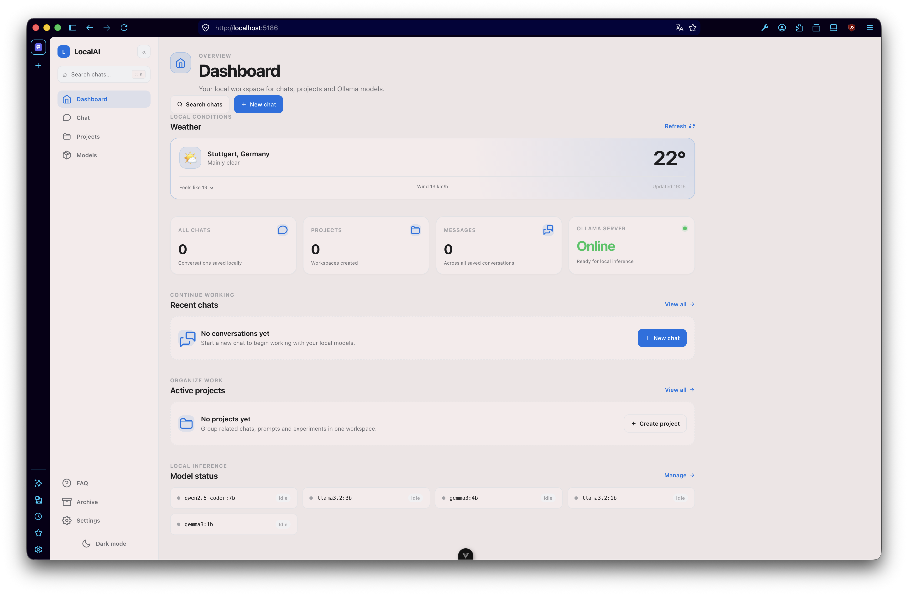
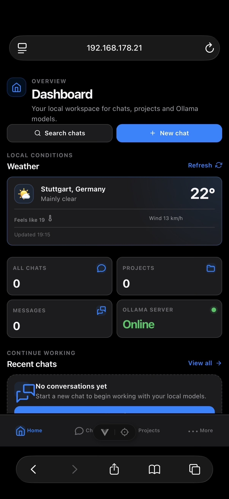

<div align="center">

# Locale AI

**A privacy-first chat interface for local LLMs.**  
Powered by Vue 3 and Ollama — no account, API key, or cloud required.

<p>
  <a href="https://ial-locale-intelligence.vercel.app">
    
  </a>
</p>

<p>
  
  
  
</p>

</div>

---

## Overview

Locale AI lets you chat with models running on your own machine through Ollama. Your conversations remain local: no external database, cloud backend, or account is required.

<div align="center">
  
  <br /><br />
  
</div>

---

## Features

| Area                   | What it offers                                                                        |
| ---------------------- | ------------------------------------------------------------------------------------- |
| **Chat**               | Streaming responses, message editing, regeneration and persistent local conversations |
| **Projects**           | Organize chats in projects and use different models for individual projects           |
| **Model controls**     | Configure a system prompt, temperature and context window per chat                    |
| **Search**             | Search across all chats and projects from one place                                   |
| **Ollama integration** | View installed models and their current loaded status                                 |
| **Privacy**            | All chat data is stored locally in your browser via LocalStorage                      |
| **Interface**          | Responsive layout with dark and light themes                                          |
| **Export**             | Export conversations as Markdown files                                                |

---

## Quick Start

### Prerequisites

- [Node.js](https://nodejs.org/)
- [Ollama](https://ollama.com/)

### Installation

```bash
git clone https://github.com/beri336/locale-ai
cd locale-ai
npm install
```

### Download a model

Pull any Ollama-compatible model. For example:

```bash
ollama pull llama3
```

### Start Locale AI

```bash
npm run dev
```

Open the local URL shown in your terminal, then start chatting.

### Production build

```bash
npm run build
npm run preview
```

## Remote & Mobile Access

To access Locale AI from another device in your local network, start the frontend with:

```bash
npm run dev -- --host
```

Ollama must also be reachable from that device:

```bash
OLLAMA_HOST=0.0.0.0 OLLAMA_ORIGINS="*" ollama serve
```

> [!WARNING]
> `OLLAMA_HOST=0.0.0.0` exposes Ollama on your local network, while `OLLAMA_ORIGINS="*"` permits requests from any website opened in your browser. Prefer restricting allowed origins when possible.

## Configuration

Open **Settings** in Locale AI to configure your Ollama endpoint.

| Setting        | Default                  | Description                                                 |
| -------------- | ------------------------ | ----------------------------------------------------------- |
| Ollama URL     | `http://localhost:11434` | Address of the Ollama API                                   |
| Theme          | System                   | Choose light or dark                    |
| Model settings | Per chat                 | Override the system prompt, temperature and context window |

---

## Tech Stack

| Layer            | Technology                    |
| ---------------- | ----------------------------- |
| Frontend         | [Vue 3](https://vuejs.org/)   |
| Build tool       | Vite                          |
| PWA              | [vite-plugin-pwa](https://vite-pwa-org.netlify.app/) |
| Local AI runtime | [Ollama](https://ollama.com/) |
| Persistence      | Browser LocalStorage          |
| Deployment       | Vercel                        |

---

## Privacy

Locale AI is designed to work locally:

- No user accounts
- No API keys
- No cloud database
- No chat data sent to a third-party backend
- Models run through your local Ollama instance

---

## License

Copyright © 2026 beri336. All rights reserved.

This repository is publicly available solely for portfolio and evaluation purposes.
Use, copying, modification, redistribution, or commercial use of this project is
not permitted without prior written permission.

See [LICENSE](./LICENSE) for the full terms.

---

## Author

<div align="center">

<a href="https://github.com/beri336">
  
</a>
<a href="https://bitbucket.org/berkants/workspace/projects/DEV">
  
</a>

<br /><br />

Made with Vue 3 · Runs locally · No account required

</div>
